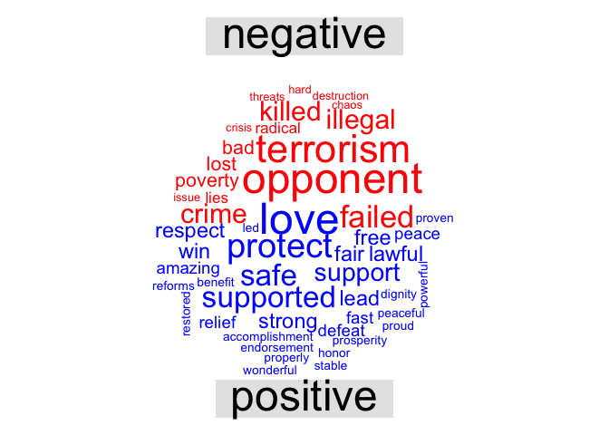
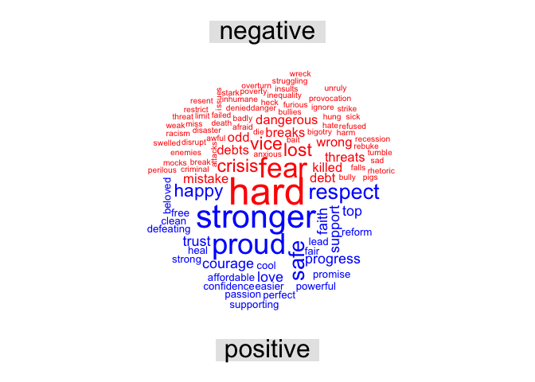
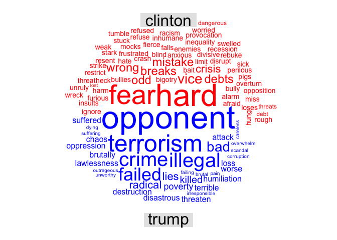
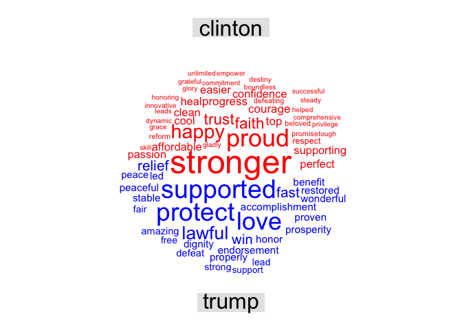

hw09
================
Abby Bergman
11/27/2018

A Comparison of 2016 Democratic and Republican Party Nomination Speeches
========================================================================

Comparison of Negative and Positive Words for Trump
---------------------------------------------------

Comparison of Negative and Positive for Clinton
-----------------------------------------------

Comparison of Trump and Clinton's Negative Words
------------------------------------------------

Comparison of Trump and Clinton's Positive Words
------------------------------------------------

