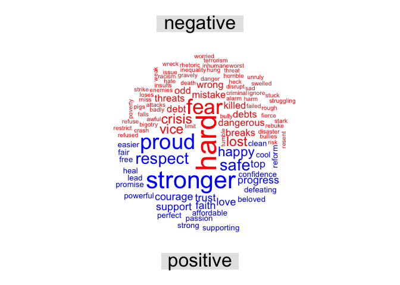

hw09
================
Abby Bergman
11/27/2018

A Comparison of 2016 Democratic and Republican Party Nomination Speeches
========================================================================

Comparison of Negative and Positive Words for Trump
---------------------------------------------------

The above word cloud compares negative and positive word uses for Donald Trump's 2016 Republican Party nomination speech. The most commonly used negative words (shown large and in red) were opponent and terrorism. His most used positive words were love and protect. \#\# Comparison of Negative and Positive for Clinton

The above graph shows the most used word in Hillary Clinton's 2016 Democratic party nomination speech, compared between negative and positive sentiment using the bing lexicon. Her most used negative words are hard and fear. Her most used positive words are stronger and proud.

Comparison of Trump and Clinton's Negative Words
------------------------------------------------

The above worcloud shows the most used negative words of both speeches compared by speaker. Although this image shpws the same words as the previous two, this organization males a different comparison. Ths image shows that none of the most used words do not overlap between the two speeches.

Comparison of Trump and Clinton's Positive Words
------------------------------------------------

Just as there was little to no overlap between highly used negative words in the two speeches, there was no overlap in the most used positive words.
