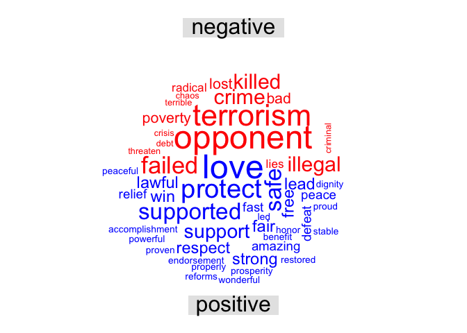
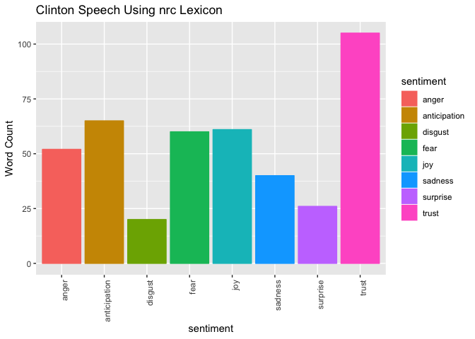

hw09
================
Abby Bergman
11/27/2018

A Comparison of 2016 Democratic and Republican Party Nomination Speeches
========================================================================

For this assignment, I decided to explore sentiments in the 2016 party nomination speeches. I chose to use the bing lexicon primarily because I was most interested in positive and negative sentiments. I used the nrc lexicon to look at more specific sentiments in the speeches.

Comparison of Negative and Positive Words for Trump
---------------------------------------------------



The above word cloud compares negative and positive word uses for Donald Trump's 2016 Republican Party nomination speech. The most commonly used negative words (shown large and in red) were opponent and terrorism. His most used positive words were love and protect.

Comparison of Negative and Positive for Clinton
-----------------------------------------------


The above graph shows the most used word in Hillary Clinton's 2016 Democratic party nomination speech, compared between negative and positive sentiment using the bing lexicon. Her most used negative words are hard and fear. Her most used positive words are stronger and proud.

Comparison of Trump and Clinton's Negative Words
------------------------------------------------


The above wordcloud shows the most used negative words of both speeches compared by speaker. Although this image shpws the same words as the previous two, this organization males a different comparison. Ths image shows that none of the most used words do not overlap between the two speeches.

Comparison of Trump and Clinton's Positive Words
------------------------------------------------


Just as there was little to no overlap between highly used negative words in the two speeches, there was no overlap in the most used positive words.

``` r
#join speeches with nrc lexicon
sentiment_nrc <- get_sentiments("nrc")

nrc_trump <- trump_tidy %>%
  inner_join(sentiment_nrc)
```

    ## Joining, by = "word"

``` r
nrc_clinton <- clinton_tidy %>%
  inner_join(sentiment_nrc)
```

    ## Joining, by = "word"

``` r
#filter combined set for the sentiments I want
nrc_clinton %>%
  unique() %>%
  filter(sentiment != "positive") %>%
  filter(sentiment != "negative") %>%
  count( sentiment) %>%
   ggplot() +
  geom_col(aes(sentiment, n, color = sentiment, fill = sentiment)) +
  theme(axis.text.x = element_text(angle = 90, hjust = 1)) + #rotate axis labels
    labs(title = "Clinton Speech Using nrc Lexicon", y = "Word Count")
```



``` r
#use theme(axis.text.x = element_text(angle = 90, hjust = 1)) to rotate axis labels

#filter trump set for the sentiments I want
nrc_trump %>%
  unique() %>%
  filter(sentiment != "positive") %>%
  filter(sentiment != "negative") %>%
  count( sentiment) %>%
   ggplot() +
  geom_col(aes(sentiment, n, color = sentiment, fill = sentiment)) +
  theme(axis.text.x = element_text(angle = 90, hjust = 1)) + #rotate axis titles
  labs(title = "Trump Speech Using nrc Lexicon", y = "Word Count")
```


The two speeches have similar breakdowns using the nrc lexicon. Both speeches had high use of trust words and low use of disgust and surprise words. The Trump speech incorporated more use of fear and anger words, while the Clinton speech used more anticipatory words. Overall, when compared this way, the speeches had arguably more similarities than differences.
